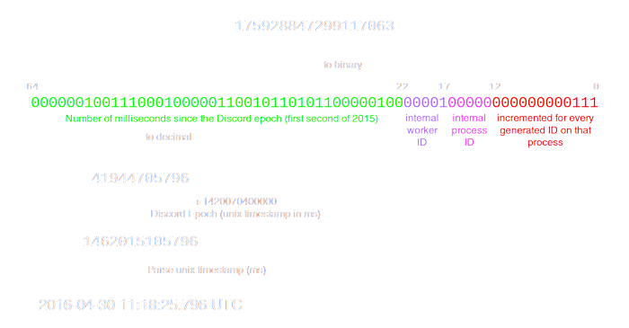

# Snowblind

Snowblind is a simple tool for trying to guess future discord ids. The main purpose of this tool is to obtain a discord message that contains a link to itself.

## Usage

### Installation

1. Install [Node.js](https://nodejs.org/en/download/)
2. Clone this repository
3. Run `npm install` in the repository directory

### Running

```bash
$ npm start
```

# How it works
Before we get into the details, here is a nice graphic made by discord:
&nbsp;

As we can see, snowflake contains 4 different parts:
**Timestamp** - The time the message was sent.
**Worker ID** - The ID of the worker that processed the message.
**Process ID** - The ID of the process that processed the message.
**Increment** - The ID of the message in the process. 

## Timestamp
Technique used to guess the timestamp is pretty simple. It's just average of diffrence in timestamp between guessed and actual id.
Formula used for guessing timestamp is actually `Date.now() - epoch - averageDifference`.

## Worker ID
Worker ID is actually mostly constant so we don't really care about it. We can just set it to value from previous message.

## Process ID
Process ID is very random so we can't really guess it, but we can try to sometimes predict it using `Increment` part. `Increment` is incremented by 1 every time current process is processing a request. So if the previous message had `Increment` very low, for example 20, we can assume that the next message will fit in the same process, so we can reuse the same `Process ID` from previous message.

## Increment
As mentioned before, `Increment` is incremented by 1 every time current process is processing a request. It's mostly random number from 0 to 255(?). But after closer look, we can see that last digit is almost always 0 and it looks like highest last digit = lower chance of appearing. We can use this to our advantage and still use randomness, but with higher chance of getting correct last digit.